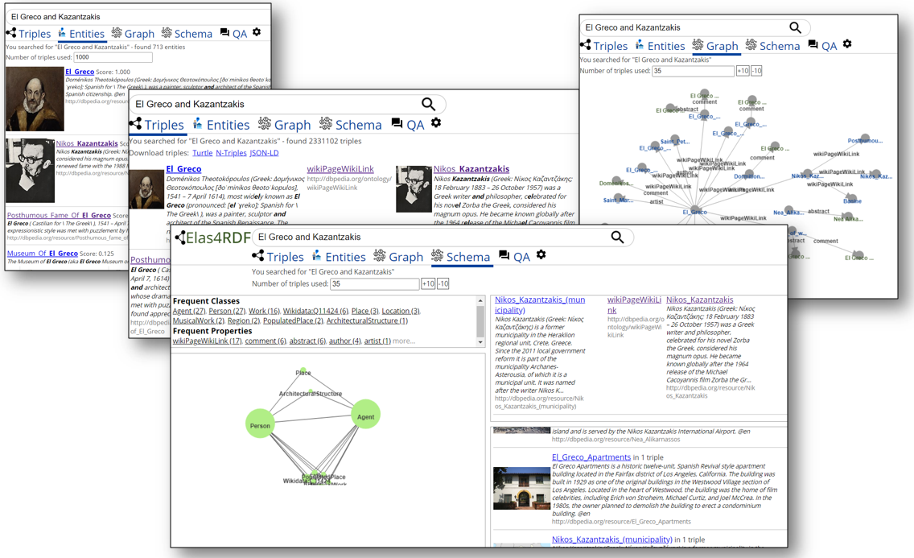

# Elas4RDF

> This repository contains code for the Elas4RDF Web Application. The code of the Question Answering Component is available at [https://github.com/cnikas/elas4rdf_qa](https://github.com/cnikas/elas4rdf_qa).

Elas4RDF is a scalable, efficient and effective method for keyword search over RDF datasets. It follows a triple-centered approach (in contrast to the entity-based approach) for providing more precise and explainable results. It relies on a special configuration of ElasticSearch for the needs of RDF. The approach is totally schema agnostic, and thus widely applicable. For capturing a wide range of information needs, Elas4RDF offers various perspectives for the search results. The current deployment is over DBpedia version 2015-10. The evaluation over DBpedia-Entity v2 test collection has shown that Elas4RDF performs similarly to systems built from scratch and use entity-oriented and dataset-specific index structures.

### Installation

    mvn clean install -DargLine="-Xmx4g" //use at least 4g ram
    java -jar -Xmx4g target/elas4rdf-demo-0.0.1-SNAPSHOT.jar
   OR
   
    mvnw spring-boot:run //windows
    ./mvnw spring-boot:run //linux

Runs on:
localhost:8081/elas4rdf

### Configuration (application.properties file)
* qaurl: the url for the [QA component](https://github.com/cnikas/elas4rdf_qa)'s REST endpoint
* elas4rdfurl: the url of the instance of elas4rdf search service used
* datasetId: the dataset id on elas4rdf (e.g. dbpedia)
* extField: the field used for the extended information (e.g. rdfs_comment)

### Main class for each tab

* [Triples & Entities](src/main/java/gr/forth/ics/isl/elas4rdfdemo/KeywordSearch.java)
* [Graph](src/main/java/gr/forth/ics/isl/elas4rdfdemo/AnswerExploration.java) 
* [Schema](src/main/java/gr/forth/ics/isl/elas4rdfdemo/SchemaTab.java)
